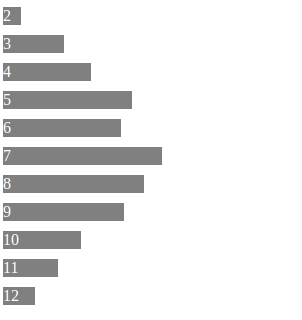

## Description

When rolling two six-sided dice, each die will show a number between 1 and 6. When the numbers on the two dice are added together, they will sum to a number between 2 and 12. Repeating this trial a number of times, you can generate enough data to create a bar graph displaying the frequency of each trial result, which can be visualized like the following example:

### Part 1: Implement Functions

Your first task is to write the implementation for three javascript functions, `randomInteger`, `times`, and `createKeyCount`. By using just these three functions in the correct order, you will be able to simulate summing of any number of N-sided dice rolls, and repeating this process any number of times.

- For `randomInteger`, you will need to figure out how to properly generate random integers in JavaScript.

- For `times`, you will need to figure out how to call a provided function the provided number of times, and return the results in an array.

- For `createKeyCount`, you will need to figure out how to create an object whose keys represent every unique value in an input array, and whose values are the number of times that unique value is found in the input array.

You will be provided the implementation for a function called `execute`, which calls each of the previous 3 functions in the proper order.

### Part 2: Display Bar Graph

Display the final counts as a bar graph (using a DIV for each bar, and varying the dimensions in proportion with the counts).

### Grading

- Correctly implement `randomInteger` _(1 point)_
- Correctly implement `times` _(2 point)_
- Correctly implement `createKeyCount` _(3 point)_
- Correctly implement `createBarGraph` _(4 point)_
